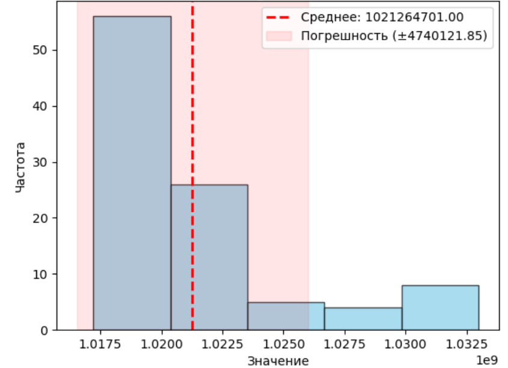
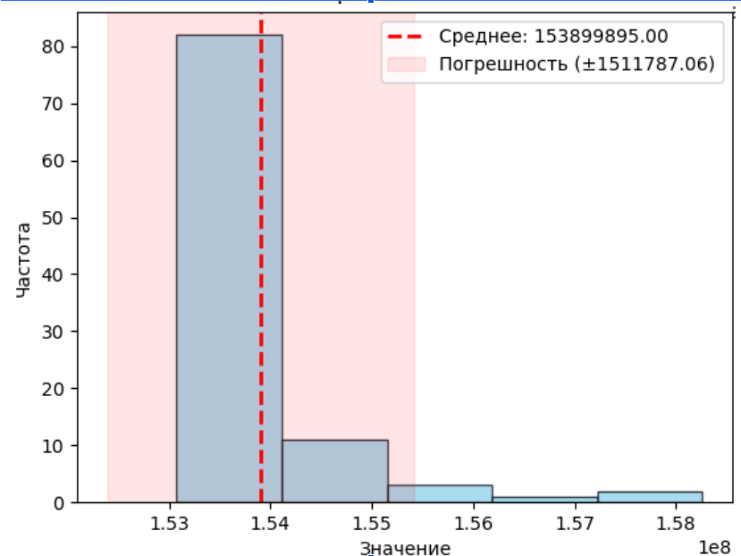
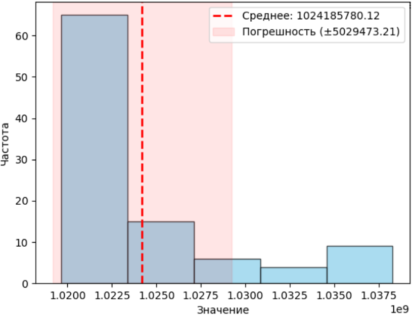
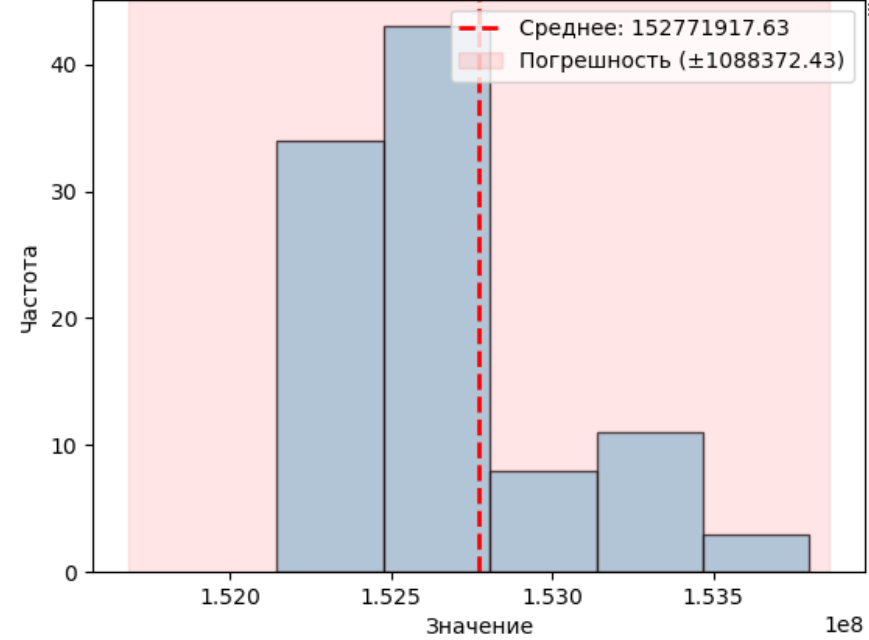
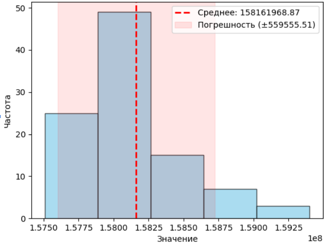

# Отчет: Оптимизация визуализации множества Мандельброта

## 1. Информация о системе

| Параметр | Значение |
| :--- | :--- |
| **ОС** | Linux (WSL2, Kernel 6.6.87.2) |
| **Процессор** | AMD Ryzen 9 8945HX |
| **Средняя частота** | 2495 MHz |
| **Компиляторы** | g++ 13.3.0, clang++ 18.1.3 |
| **Флаги сборки** | `-g -O2 -DNDEBUG -march=native` |
| **Среднее время замера** | ~30 секунд |

---

## 2. Как строится множество Мандельброта

Множество Мандельброта строится на комплексной плоскости. Для каждой точки $c = (cx, cy)$ проверяется поведение итерационной последовательности:
$$z_{n+1} = z_n^2 + c$$
где $z_0 = 0$. 

В программной реализации мы представляем комплексное число $z$ как пару `(zx, zy)`. На каждой итерации вычисляются новые координаты:
*   `new_zx = zx*zx - zy*zy + cx`
*   `new_zy = 2*zx*zy + cy`

Если модуль числа $|z|$ (в коде проверка `zx*zx + zy*zy >= 4.0f`) превышает 2, точка "улетает" в бесконечность. Цвет пикселя определяется номером итерации $n$, на которой произошел вылет. Если точка не вылетела за `MAX_ITERATIONS`, она считается частью множества.

---

## 3. Методика измерения

Для получения максимально точных и воспроизводимых результатов были соблюдены следующие условия:
*   **Изоляция системы:** Все ресурсоемкие приложения (браузеры, мессенджеры) были закрыты. Работа велась в "чистом" окружении с открытым терминалом и VS Code.
*   **Энергопотребление:** Ноутбук подключен к сети (на полной зарядке), режим электропитания установлен в положение «Максимальная производительность».
*   **Инструментарий:** Измерения проводились не по системному времени, а с помощью инструкции процессора `__rdtscp` (через обертку в `timer.hpp`). Это позволяет считать такты процессора напрямую, минимизируя влияние планировщика ОС.
*   **Статистика:** Для каждой версии выполнялось 100 итераций расчета кадра. Результаты записывались в `.csv` файл для последующего усреднения.
*   **Подавление оптимизаций:** Чтобы компилятор не «выкинул» пустые вызовы функций при замерах, использована ассемблерная вставка `__asm__ volatile("" : : "g" (pixels) : "memory")`, которая гарантирует честное выполнение расчетов.

---

## 4. Подробное описание версий

*   **Native:** Классический вложенный цикл. Понятный код, минимальная скорость.
*   **Arrays:** Промежуточный этап. Код переписан так, чтобы обрабатывать 8 значений параллельно в массивах. Это «разжевывание» логики для компилятора. Как видно из результатов Clang, это самый эффективный способ: код остается читаемым, а скорость — максимальной.
*   **Intrinsics:** Прямое использование команд процессора `_mm256`. Мы вручную управляем регистрами. Это дает стабильно высокий результат на любом компиляторе, так как мы забираем управление векторизацией у оптимизатора.

---

## 5. Анализ производительности

### Результаты измерений (в миллионах тактов)

| Компилятор | Native (Baseline) | Arrays (Auto-SIMD) | Intrinsics (Manual) |
| :--- | :---: | :---: | :---: |
| **g++ 13.3.0** | 1021 ± 5 | 159 ± 1 | **154 ± 1** |
| **clang++ 18.1.3** | 1024 ± 5 | **153 ± 1** | 158 ± 1 |

| Компилятор \ Версия | Native | Arrays | Intrinsics |
| :--- | :---: | :---: | :---: |
| **g++** |  |  |  |
| **clang++** |  |  |  |

### Разбор результатов и влияние изменений

1.  **Native (Скалярная версия):** Оба компилятора показывают идентичный результат (~1022 млн тактов). Это предел последовательных вычислений, когда одно ядро обрабатывает по одному числу за раз.
2.  **Эффект векторизации (Arrays/Intrinsics):** 
    *   Обе оптимизированные версии быстрее Native примерно в **6.5 - 6.6 раз**. 
    *   Теоретический предел для AVX2 (8 чисел float) не достигается из-за «эффекта хвоста»: в векторе из 8 пикселей итерации продолжаются до тех пор, пока не «вылетит» самый медленный пиксель.
3.  **Разница компиляторов:**
    *   **Clang++** продемонстрировал феноменальную работу с версией **Arrays (153 млн тактов)**. Это означает, что его движок автовекторизации смог идеально переложить код на массивах в векторные инструкции, оптимизировав их даже лучше, чем ручные интринсики. 
    *   **G++** лучше справился с **Intrinsics (154 млн тактов)**. Для этого компилятора явное указание инструкций программистом дает лучший результат, так как в версии Arrays он оставляет небольшие накладные расходы на проверки.

---